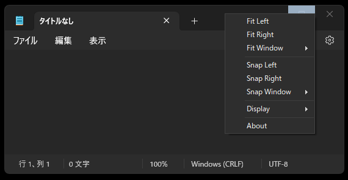
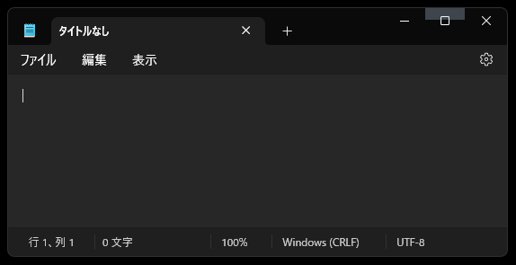
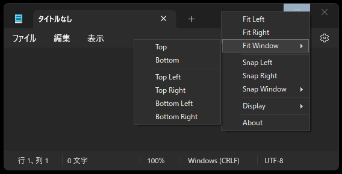
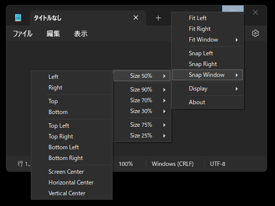
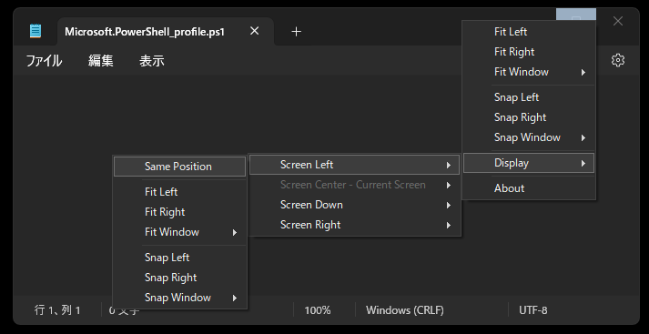
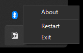

# ActiveWindowControl

## Overview

ActiveWindowControl is software that enhances the usability of Windows.
It is placed over the maximize button of the active window you are operating, and has the function of moving the window by mouse hover or click.

The images show it attached to Notepad, but it is compatible with most Windows applications such as Chrome, Edge, VSCode, Visual Studio, Windows Terminal, and Calculator.

## Download

ActiveWindowControl/Release at main · standard-software/ActiveWindowControl  
https://github.com/standard-software/ActiveWindowControl/tree/main/Release  

From here, obtain the latest version of ActiveWindowControl.zip, extract it, and place it in a folder of your choice.

## Detailed Features

### Fit Window

Fit Left / Right and Top / Bottom / Top Left / Top Right / Bottom Left / Bottom Right move the window to the left, right, top, bottom, or corners of the screen.

Fit Left / Right maintains the original window width and moves it to the left or right.

Fit Top / Bottom maintains the original window height and moves it to the top or bottom.

Fit Top Left and other corner Fits maintain the original window height and width and move to the corner.

### Snap Window

Snap Left / Right in the root part of the menu moves the window to the left or right with a width of 50%.

Each menu in Snap Window determines the window size by the ratio of the screen size.

Left / Right determines the width by the specified ratio and snaps the window.

Top / Bottom determines the height by the specified ratio and snaps the window.

Top Left and other corner snaps determine the width and height by the specified ratio and snap the window.

Screen Center / Horizontal Center / Vertical Center also determine the width and height and move to the screen position.

### Display

The Display menu allows you to move screens around.

This menu appears when you are using two or more displays.

Displays are sorted from left to right, up to down. (The order does not match the numbering of the Windows settings.)

The main display is the Screen Center.
The one on the left will be labeled Screen Left / Screen Left Up / Screen Left Down, etc.

The window displaying the current application is disabled because it is not the target of the move.

Same Position allows you to move to another display while maintaining the current window's proportionate position on the display.

Snap and Fit are for the target display, respectively.

### About

The version of ActiveWindowControl is displayed.

### Tray Icon

Double-clicking the tray icon restarts ActiveWindowControl.

ActiveWindowControl sometimes goes missing, so please restart it when that happens.

Clicking the tray icon, either left or right click, displays the menu.

About displays information.
Restart restarts ActiveWindowControl.
Exit closes ActiveWindowControl.

## Info

standard-software/ActiveWindowControl  
https://github.com/standard-software/ActiveWindowControl/tree/main

## Contact

standard.software.net@gmail.com  
  Japanese / English

